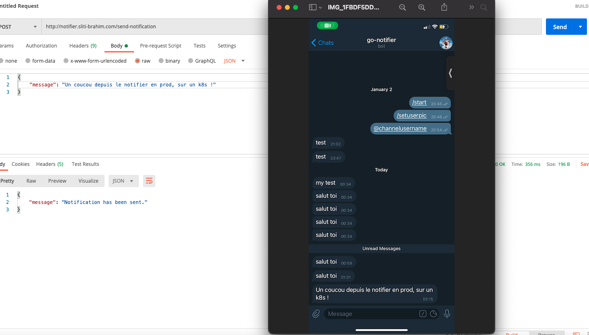

 

  

<h3 align="center">go-telegram-notifier</h3>

# go-telegram-notifier

A Go REST API wrapping the official Telegram API and used to send myself notifications, all combined in one file.

## Overview

Here is an overview of the use of that API (in production).

  

